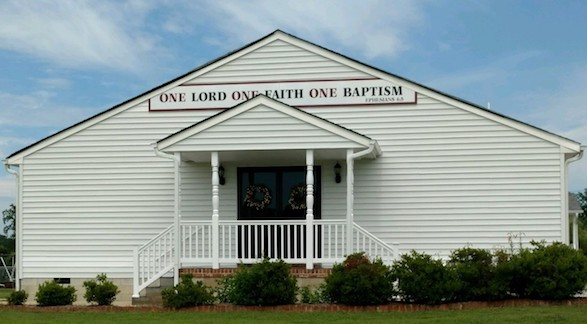

# True Life Church
## Apostolic Church of Jesus Christ

#### Our Statment of Faith

We believe in the Bible standard of full salvation, which is repentance, baptism in water by immersion in the name of the Lord Jesus Christ for the remission of sins, the baptism of the Holy Ghost with the initial sign of speaking with other tongues as the Spirit gives the utterance, and living a godly life of holiness.

#### Our Services 

**Sunday Services**

Bible School - 10:00 AM to 11:00 AM

Worship Service - 11:00 AM to 12:00 PM

**Wednesday Services** 

Bible Study - 7:30 PM - 8:30 PM
